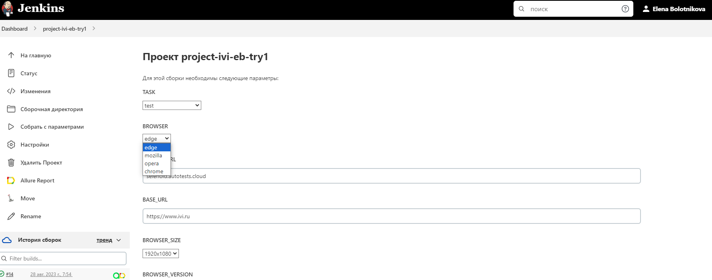

# Проект по тестированию элементов сайта "Иви"

сделано в рамках дипломного проекта для qa.guru
 

> <a target="_blank" href="https://www.ivi.ru">ivi.ru</a>

## Оглавление

- <a href="#tools">Использованный стек технологий</a>
- <a href="#list">Список проверок</a>
- <a href="#jenkins">Удаленный запуск через Jenkins</a>
- <a href="#allure">Результаты запуска тестов в Allure Report</a>
- <a href="#testops">Интеграция с Allure TestOps</a>
- <a href="#jira">Интеграция с Jira</a>
- <a href="#tg">Результаты запуска тестов в Telegram-боте</a>
- <a href="#vic">Видео одной из проверок</a>

Для написания проектов использовался язык **Java**  и фреймворк тестирования **Selenide**. Среда сборки **IntelliJ IDEA
** сочетается с **Gradle**.
**JUnit5** - фреймворк модульного тестирования. Запуск тестов выполняется из **Jenkins**. **Selenoid** используется для
запуска браузеров в контейнерах **Docker**.

**Allure Report**, **AllureTestOps** и **Telegram Bot** использованы для визуализации результатов проверок.

## :heavy_check_mark: Тест кейсы

- Проверка на присутствие в маркетах приложений приложения Иви
- Проверка проставления рейтинга фильмов
- Проверка на регистрацию пользователя
- Проверка на регистрацию пользователя с неверным форматом email
- Проверка на поиск фильмов по заголовкам
- Проверка возможности поделиться фильмом в соцсети
- Проверка сортировки фильмов по годам

## </a> Задача в <a target="_blank" href="https://jenkins.autotests.cloud/job/project-ivi-eb-try1/">Jenkins</a>

 
 

> Jenkins позволяет сделать тест параметризованным, выбрать нужный браузер, разрешение

## </a> Отчет в <a target="_blank" href="https://jenkins.autotests.cloud/job/project-ivi-eb-try1/allure/">Allure Report</a>

> Отчет позволяет детально посмотреть шаги выполнения тестов

> Также отчет предоставляет вложение с последним скриншотом, кодом страницы, логами и видео, фиксирующим ход выполнения теста.

## </a> Отчет в <a target="_blank" href="https://allure.autotests.cloud/launch/29495">Allure TestOps</a>

> Интеграция с TestOps позволяет выборочно или поточно запускать тесты

## </a> Отчет в <a target="_blank" href="https://jira.autotests.cloud/browse/HOMEWORK-857">Jira</a>

> Тест-кейсы и результаты прогонов можно прикреплять к задачам в Jira

## </a> Уведомление в Telegram при помощи бота

> После завершения сборки специальный бот, созданный в <code>Telegram</code>, автоматически обрабатывает и отправляет
> сообщение с отчетом о прогоне.

> Видео к прохождению теста "Проверка на присутствие в маркетах приложения Иви" на Selenoid

  

